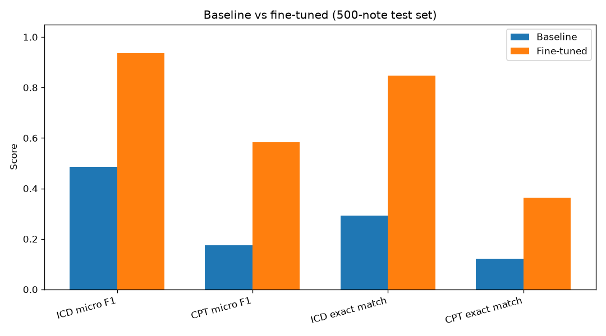
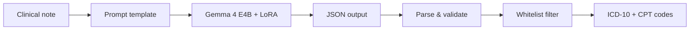
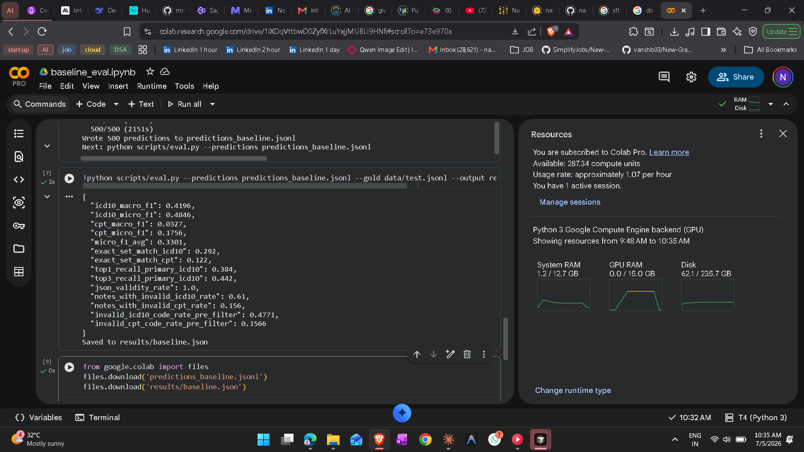
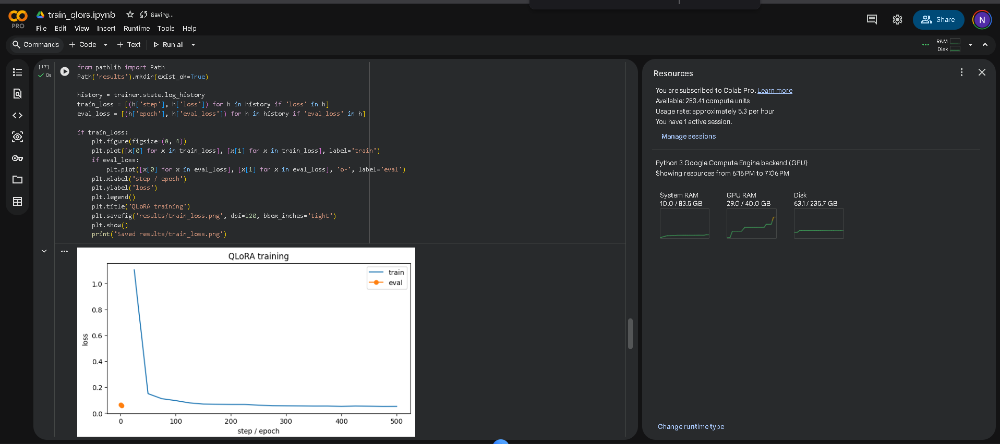
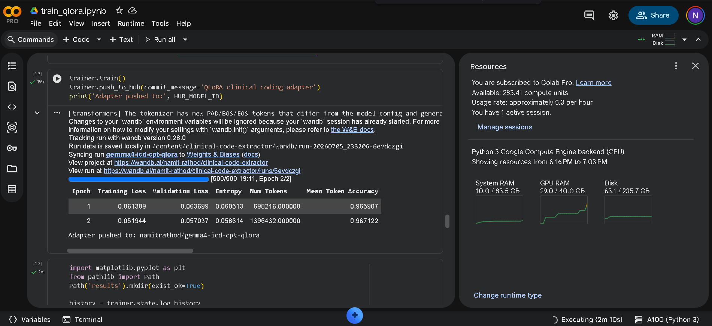
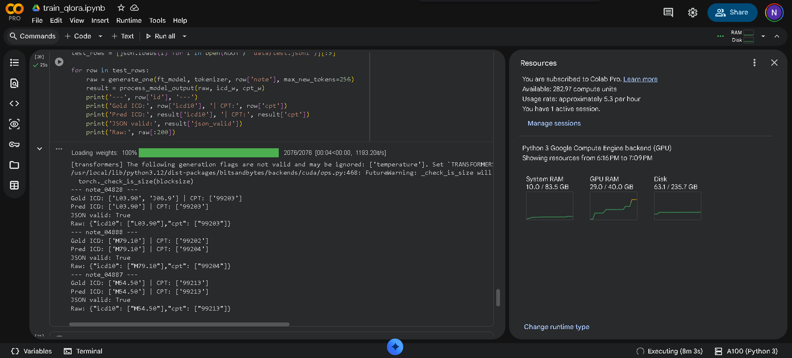

# Clinical Code Extractor

End-to-end LLM pipeline that maps free-text clinical notes to structured **ICD-10** and **CPT** billing codes. Fine-tuned **Gemma 4 E4B** with **QLoRA** on a synthetic primary-care dataset; evaluated on a 500-note held-out test set with reproducible scripts and published weights.

[](https://huggingface.co/namitrathod/gemma4-icd-cpt-qlora)
[](https://huggingface.co/google/gemma-4-E4B-it)

| | Baseline | Fine-tuned | Lift |
|---|:---:|:---:|:---:|
| **ICD-10 micro F1** | 0.48 | **0.94** | +0.45 |
| **CPT micro F1** | 0.18 | **0.58** | +0.41 |
| **Primary ICD recall** | 38% | **100%** | +62 pp |
| **Invalid code rate** | 61% | **0%** | −61 pp |



---

## Summary

Clinical documentation must be translated into standardized billing codes — a high-volume, error-sensitive task. General-purpose LLMs produce plausible text but frequently emit **invalid codes**, **wrong JSON schemas**, or **hallucinated procedures**.

This project demonstrates that a **parameter-efficient fine-tune** (4-bit QLoRA) on a **bounded code vocabulary** can turn a general model into a reliable structured extractor, with rigorous offline evaluation and a deterministic post-processing layer.

**Headline result:** ICD-10 micro-F1 improved from **0.48 → 0.94**; CPT micro-F1 from **0.18 → 0.58**; primary-diagnosis recall reached **100%** with **zero invalid codes** after whitelist filtering.

---

## System Design



| Layer | Implementation |
|-------|----------------|
| **Base model** | [`google/gemma-4-E4B-it`](https://huggingface.co/google/gemma-4-E4B-it) (4-bit NF4 via bitsandbytes) |
| **Adapter** | [`namitrathod/gemma4-icd-cpt-qlora`](https://huggingface.co/namitrathod/gemma4-icd-cpt-qlora) — LoRA on attention projections |
| **Training** | TRL `SFTTrainer`, completion-only loss, `prompt` / `completion` columns |
| **Vocabulary** | ~50 ICD-10 + ~40 CPT codes (`codes/`) — primary / urgent care scope |
| **Data** | 4,000 train · 500 val · 500 test synthetic notes from templates |
| **Inference guardrails** | JSON repair, schema normalization, whitelist filter (`src/validate.py`) |
| **Eval** | Multi-label micro/macro F1, exact-set match, primary-ICD recall (`scripts/eval.py`) |

---

## Evaluation

**Test set:** 500 held-out notes · **Metrics computed on whitelisted codes only**

| Metric | Baseline | Fine-tuned | Δ |
|--------|:--------:|:----------:|:---:|
| ICD-10 micro F1 | 0.48 | **0.94** | +0.45 |
| ICD-10 macro F1 | 0.42 | **0.98** | +0.56 |
| CPT micro F1 | 0.18 | **0.58** | +0.41 |
| CPT macro F1 | 0.03 | **0.44** | +0.40 |
| Exact set match (ICD) | 0.29 | **0.85** | +0.56 |
| Exact set match (CPT) | 0.12 | **0.36** | +0.24 |
| Top-1 primary ICD recall | 0.38 | **1.00** | +0.62 |
| JSON validity rate | 1.00 | 1.00 | — |
| Notes with invalid ICD | 61% | **0%** | −61 pp |

Artifacts: [`results/baseline.json`](results/baseline.json) · [`results/finetuned.json`](results/finetuned.json) · [`results/comparison.md`](results/comparison.md)

<details>
<summary><strong>Colab evaluation runs</strong></summary>

**Baseline** (T4 GPU)



**Fine-tuned** (A100 GPU)


</details>

---

## Training

QLoRA fine-tuning on Google Colab A100 (~1 epoch, completion-only SFT). Training loss converged within the first 50 steps; eval loss stable at ~0.1.

<details>
<summary><strong>Training artifacts</strong></summary>








</details>

Notebook: [`notebooks/train_qlora.ipynb`](notebooks/train_qlora.ipynb)

---

## Error Analysis

Fine-tuning resolved ICD extraction and eliminated hallucinated codes. Remaining errors cluster in two categories:

1. **E/M level disambiguation** — CPT visit codes (99202 vs 99203 vs 99204) require subtle documentation cues the model still confuses.
2. **Secondary diagnoses** — comorbidities mentioned briefly in the note are sometimes dropped.

| Note type | Gold | Predicted | Root cause |
|-----------|------|-----------|------------|
| Urgent care — cervicalgia | ICD `M54.2`, `E66.9` · CPT `99204` | ICD `M54.2`, `I10` · CPT `99203` | Wrong comorbidity; E/M level off by one |
| Wellness — knee pain | ICD `M25.562`, `I10` · CPT `99396` | ICD `M25.562` · CPT `99386` | Missed secondary ICD; preventive code variant |
| CKD follow-up | ICD `N18.30`, `I10` · CPT `99204` | ICD `N18.30` · CPT `99203` | Missed hypertension; lower E/M code |

Full failure set: [`results/failure_cases.json`](results/failure_cases.json)

---

## Reproducibility

```bash
pip install -r requirements.txt

# Data pipeline
python scripts/build_code_tables.py
python scripts/generate_synthetic_data.py --train 4000 --val 500 --test 500
python scripts/prepare_training_data.py

# Baseline eval (GPU)
python scripts/run_baseline.py --gold data/test.jsonl --output predictions_baseline.jsonl
python scripts/eval.py --predictions predictions_baseline.jsonl --output results/baseline.json

# Fine-tuned eval (GPU) — adapter: namitrathod/gemma4-icd-cpt-qlora
python scripts/run_finetuned.py --adapter namitrathod/gemma4-icd-cpt-qlora --gold data/test.jsonl --output predictions_finetuned.jsonl
python scripts/eval.py --predictions predictions_finetuned.jsonl --output results/finetuned.json

# Optional local Gradio demo
python app.py
```

Training is documented in [`notebooks/train_qlora.ipynb`](notebooks/train_qlora.ipynb) (Colab A100). Baseline eval in [`notebooks/baseline_eval.ipynb`](notebooks/baseline_eval.ipynb).

---

## Repository Layout

```
codes/           ICD-10 & CPT whitelists
data/            train / val / test JSONL splits
src/             prompts, validation, inference
scripts/         data generation, training prep, eval pipelines
notebooks/       Colab training & evaluation
results/         metrics, predictions, charts
Screenshots/     run captures
app.py           Gradio inference UI (optional)
```

---

## Limitations & Next Steps

| Constraint | Detail |
|------------|--------|
| **Data** | Synthetic template-generated notes; no real PHI or clinical dictation noise |
| **Scope** | ~90-code subset; not production billing coverage |
| **CPT accuracy** | 58% micro-F1 — E/M and preventive visit codes need more signal |
| **Deployment** | Inference requires GPU for practical latency; 4-bit QLoRA on CPU is viable but slow |

**Planned improvements:** de-identified real notes, SOAP segmentation, FHIR export, confidence scoring with human-in-the-loop review.

> **Disclaimer:** Research and portfolio project only. Not intended for clinical decision-making or billing submission.

---

## License

Gemma 4 weights: [Apache 2.0](https://huggingface.co/google/gemma-4-E4B-it). Project code and synthetic data: open use for research and portfolio purposes.
